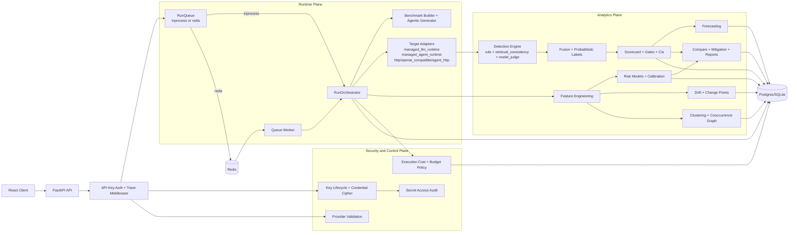

# MetroX

MetroX is a reliability engineering platform for LLM and AI-agent systems. It executes adversarial evaluation campaigns, performs statistical failure analysis, and produces risk, drift, cost, and mitigation intelligence for production hardening.

Current product focus is finance AI agent evaluation. The repository includes 10 finance-oriented simulation agents under `apps/test-agents/agents` for controlled, repeatable adversarial validation.

## Problem Scope

MetroX is designed for teams that need deterministic answers to questions like:
- Which adversarial classes break the target system most often?
- Are regressions statistically meaningful or noise?
- Which operational factors (latency, tool behavior, retrieval quality) drive risk?
- Is reliability improving across runs, sessions, and configuration versions?

## System Capabilities

- Agent-agnostic target execution: managed runtime, HTTP, OpenAI-compatible, and agent HTTP targets.
- Extensible adapter architecture for integrating additional runtime backends.
- Agentic attack generation with role-based orchestration (attacker/critic/verifier/analyst/fraud analyst).
- Multi-turn attack phases with thread continuity and adaptive phase policies.
- Multi-detector decision fusion with uncertainty and disagreement signals.
- Statistical scoring and confidence intervals with gate-based release criteria.
- Risk modeling, calibration diagnostics, distribution drift detection, and change-point detection.
- Cost accounting, budget guards, queue backpressure, retries, and DLQ support.

## Backend Architecture (V1.12)



## End-to-End Execution Lifecycle

1. `POST /v1/runs` persists run metadata and configuration snapshot.
2. Run is enqueued via `RunQueue` (in-process or Redis backend).
3. Worker/orchestrator resolves credentials, normalizes target contract, and prepares benchmark snapshot.
4. Benchmark layer composes curated + generated attack cases with dedupe/coverage constraints.
5. Agentic generation produces adversarial variants (plus deterministic fallback path when configured).
6. Target adapter executes each case (single-turn or multi-turn), collecting response, token usage, tool events, retrieval artifacts.
7. Detection layer emits detector votes; fusion computes `failure_flags`, `confidence`, `disagreement`, and `uncertainty`.
8. Labeling layer writes probabilistic labels and adjudication candidates.
9. Costing/gating enforces budget limits and may interrupt run on policy breach.
10. Post-processing computes scorecards, risk models, calibration, drift, clustering, cooccurrence, forecast, and reports.

## Agentic Testing Framework

### Attack Generation Architecture

- `MultiAgentAttackOrchestrator` manages role-specialized generators.
- Role set: `attacker`, `critic`, `verifier`, `analyst`, `fraud_analyst`.
- Orchestration controls:
  - join policy (e.g., all-required, quorum-like semantics via config)
  - max concurrent subagents and backpressure limits
  - fail-safe constraints (cost/time/LLM-call ceilings)
  - role routing and execution order
  - prompt-file driven instructions and externalized role prompts

### Multi-Turn Adversarial Probing

- Per-case phase policy: `fixed`, `random`, or `adaptive`.
- Thread strategy supports attack-type affinity (`per_attack_type`) for continuity stress testing.
- Follow-up prompts are generated using prior response excerpts and attack-specific escalation heuristics.

### Finance Agent Simulation Pack

`apps/test-agents/agents` contains 10 domain simulations:
- `account_recovery`
- `chargeback`
- `credit_dispute`
- `expense`
- `insurance`
- `kyc`
- `loan`
- `refund`
- `transaction_monitoring`
- `wire_transfer`

These agents emulate financial operations and policy boundaries to exercise high-risk interaction paths (identity checks, refunds, disputes, payout controls, transaction-risk workflows).

## Data Science and Statistical Analysis Stack

MetroX ships a full post-run statistical analytics pipeline.

### 1) Feature Engineering

Feature families extracted per execution (`app/stats/features.py`):
- prompt/response linguistics: `prompt_length`, `response_length`
- retrieval signals: `retrieval_doc_count`, `retrieval_avg_score`
- tool/policy graph signals: `tool_call_count`, `policy_denial_count`
- runtime signals: `latency_ms`, `total_tokens`

### 2) Detection Fusion and Weak Supervision

Detection engines (`app/stats/detection.py`):
- rule-based detector
- retrieval consistency detector
- model-judge detector

Fusion outputs:
- multi-label failure flags (`hallucination`, `jailbreak_success`, `prompt_injection_success`, `tool_misuse`, `toxicity`)
- confidence, disagreement score, uncertainty
- probabilistic labels (`weak_supervision_v2`)

### 3) Reliability Scoring and Gate Decisions

Scoring (`app/stats/scoring.py`):
- rate metrics: ASR, hallucination/toxicity/tool misuse/prompt injection/jailbreak rates
- weighted composite reliability score
- bootstrap confidence intervals for each rate
- gate engine with threshold checks, regression deltas, and inference-aware rejection logic
- sample-size utility (`power_estimate_for_rate`) for experiment planning

### 4) Risk Modeling and Calibration

Risk pipeline (`app/stats/risk.py`):
- calibrated logistic regression (`CalibratedClassifierCV` with sigmoid calibration)
- constant-probability fallback under low class support
- per-failure risk probabilities with uncertainty bands
- top feature drivers from model coefficients

Calibration diagnostics:
- ECE (Expected Calibration Error)
- Brier score and decomposition outputs
- bin-wise confidence vs empirical accuracy summaries

### 5) Inference and Statistical Testing

Inference layer (`app/stats/advanced_analytics.py`):
- effect size computation per risk metric
- p-value and adjusted p-value tracking
- power and MDE estimates
- confidence interval summaries

### 6) Drift and Change-Point Detection

Drift module (`app/stats/drift.py`):
- PSI (Population Stability Index)
- Kolmogorov-Smirnov two-sample test
- KL divergence over binned distributions
- rule-based drift severity classification (low/medium/high)
- time-ordered change-point detection across session score trajectories

### 7) Unsupervised Structure Discovery

Clustering module (`app/stats/clustering.py`):
- TF-IDF vectorization (uni/bi-grams)
- optional UMAP dimensionality reduction
- optional HDBSCAN density clustering
- KMeans fallback path
- cluster summaries (top terms, size) and membership records

### 8) Graph and Forecast Analytics

Advanced analytics (`app/stats/advanced_analytics.py`):
- failure/tool cooccurrence graph construction
- short-horizon EWMA-style metric forecasting

## Repository Layout

```text
apps/
  client/         # React + Vite control plane UI
  server/         # FastAPI backend, orchestration, analytics, APIs
  test-agents/    # Finance-domain simulation target agents
docs/
  backend-architecture.mdx
Makefile
OPERATIONS_RUNBOOK.md
```

## Technology Stack

Backend (`apps/server`):
- Python 3.13
- FastAPI + Uvicorn
- SQLAlchemy + Alembic
- PostgreSQL (primary), SQLite (local fallback)
- Redis (optional queue backend)
- NumPy, Pandas, SciPy, scikit-learn, statsmodels, UMAP, HDBSCAN, NetworkX
- runtime SDK dependency sourced from GitHub URL in `pyproject.toml`

Frontend (`apps/client`):
- React 18 + TypeScript
- Vite 5
- Tailwind CSS 4
- shadcn primitives
- React Flow + Recharts

## Prerequisites

- Python `>=3.13`
- Node.js `>=20`
- `uv`
- Docker (recommended for local Postgres + Redis)

## Setup

### 1) Clone and bootstrap infra

```bash
git clone <your-repo-url>
cd metroX
docker compose up -d
cp .env.example .env
```

### 2) Install server dependencies (GitHub-sourced runtime SDK)

`apps/server/pyproject.toml` includes:
- `afk-py = { git = "https://github.com/arpan404/afk" }`

Install:

```bash
cd apps/server
uv sync --dev
cd ../..
```

Optional forced refresh from GitHub URL:

```bash
cd apps/server
uv add "afk-py @ git+https://github.com/arpan404/afk"
uv sync --dev
cd ../..
```

### 3) Install client and simulation-agent dependencies

```bash
cd apps/client && npm install && cd ../..
cd apps/test-agents && uv sync && cd ../..
```

### 4) Apply migrations

```bash
cd apps/server
uv run alembic upgrade head
cd ../..
```

### 5) Start full stack

```bash
make dev
```

Services:
- API: `http://localhost:8000`
- Test agents: `http://127.0.0.1:8001`
- UI: `http://localhost:5173`

### 6) Bootstrap encryption key (required for provider credential storage)

```bash
curl -X POST http://localhost:8000/v1/security/keys \
  -H 'X-API-Key: local-dev-key' \
  -H 'Content-Type: application/json' \
  -d '{"version":"v1","key_material":"dev-key-material","actor":"dev"}'
```

## Run Modes

```bash
make dev                 # backend + frontend + test-agents + worker
make dev backend         # backend only
make dev frontend        # frontend only
make dev test-agents     # simulation agents only
make dev worker          # queue worker only
```

## API Domains (High Level)

- Run orchestration and events: `/v1/runs*`, `/v1/queue/stats`
- Sessions/configuration profiles: `/v1/sessions*`, `/v1/config-profiles*`, `/v1/orchestration-profiles*`
- Target/provider controls: `/v1/providers*`, `/v1/provider-validate`
- Security lifecycle: `/v1/security/keys*`, `/v1/security/keys/events`, credential endpoints
- Analytics/reporting: detector votes, attack summary, drift, risk, compare, mitigation, report endpoints
- Runtime capability contract endpoint: `/v1/afk/capabilities` (legacy path name)

## Testing

```bash
make server-test
make client-test
```

Server test matrix (`apps/server`):

```bash
uv run pytest -q                  # deterministic suite
uv run pytest -q -m live_model    # opt-in live model suite
uv run pytest -q -m nightly_live_model
```

## Operational Documentation

- Backend architecture deep dive: `docs/backend-architecture.mdx`
- Runbook: `OPERATIONS_RUNBOOK.md`
