

# Backend Core Architecture (V1.11)

Canonical backend architecture documentation for MetroX V1.11, grounded in current implementation under `apps/server/app/*`.

## Scope

- Backend runtime orchestration, queueing, adapters/providers, detection fusion, risk/analytics, costing, security lifecycle, compare/mitigation/reporting, and data model.
- Documentation only; no API/schema/runtime behavior changes.

## Runtime Contracts (Write Path)

- `target_type`: `managed_llm_runtime`, `managed_agent_runtime`, `http`, `openai_compatible`, `agent_http`
- `provider_type`: `managed_llm_runtime`, `openai_compatible`

## Mini TOC

- [High-Level System Architecture](#high-level-system-architecture)
- [Backend Component Architecture](#backend-component-architecture)
- [Run Lifecycle Sequence](#run-lifecycle-sequence)
- [Queue Architecture](#queue-architecture)
- [Target Adapter and Runtime Invocation](#target-adapter-and-runtime-invocation)
- [Benchmark and Agentic Attack Generation](#benchmark-and-agentic-attack-generation)
- [Detection Fusion Architecture](#detection-fusion-architecture)
- [Feature to Risk to Advanced Analytics Pipeline](#feature-to-risk-to-advanced-analytics-pipeline)
- [Costing and Budget Gate Architecture](#costing-and-budget-gate-architecture)
- [Security and Credential Lifecycle](#security-and-credential-lifecycle)
- [Provider Validation Architecture](#provider-validation-architecture)
- [Compare Mitigation Reporting Architecture](#compare-mitigation-reporting-architecture)
- [Core Data Model ER Diagram](#core-data-model-er-diagram)
- [Endpoint Grouping by Domain](#endpoint-grouping-by-domain)
- [Scenario Traces for Validation](#scenario-traces-for-validation)
- [Code Grounding Map](#code-grounding-map)

---

## High-Level System Architecture

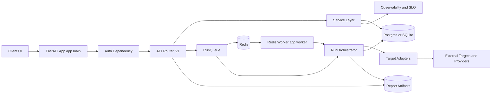

[Back to top](#top)

## Backend Component Architecture

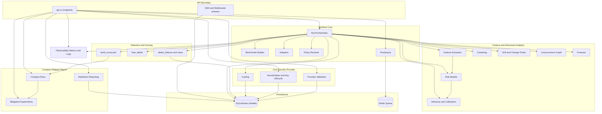

[Back to top](#top)

## Run Lifecycle Sequence

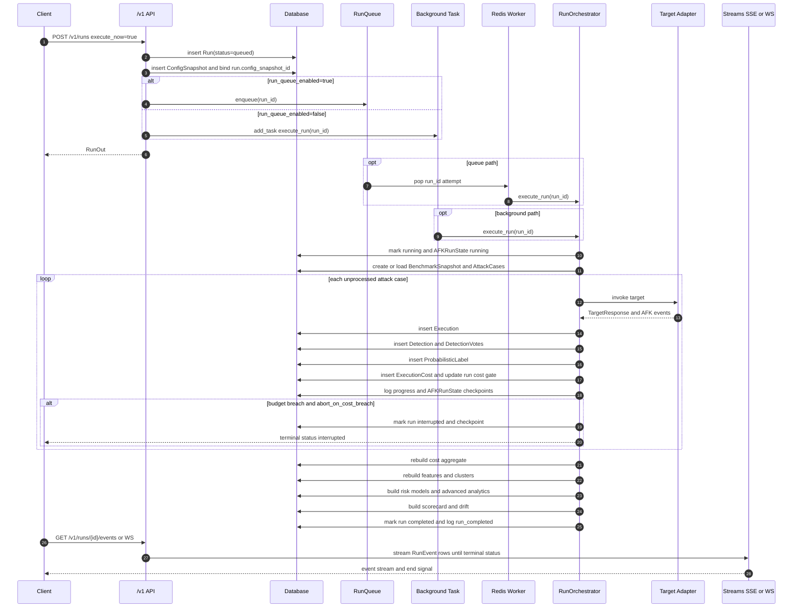

[Back to top](#top)

## Queue Architecture

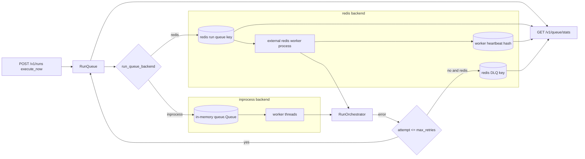

[Back to top](#top)

## Target Adapter and Runtime Invocation

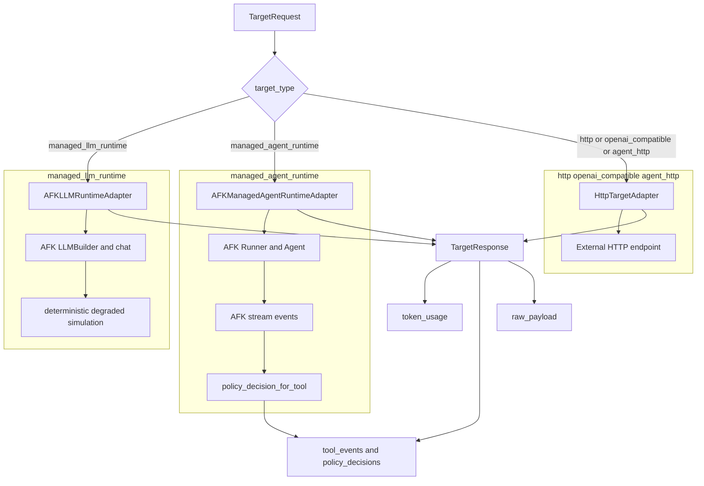

[Back to top](#top)

## Benchmark and Agentic Attack Generation

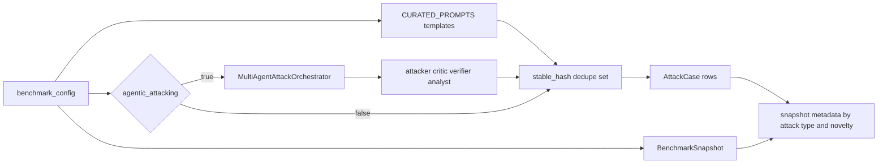

[Back to top](#top)

## Detection Fusion Architecture

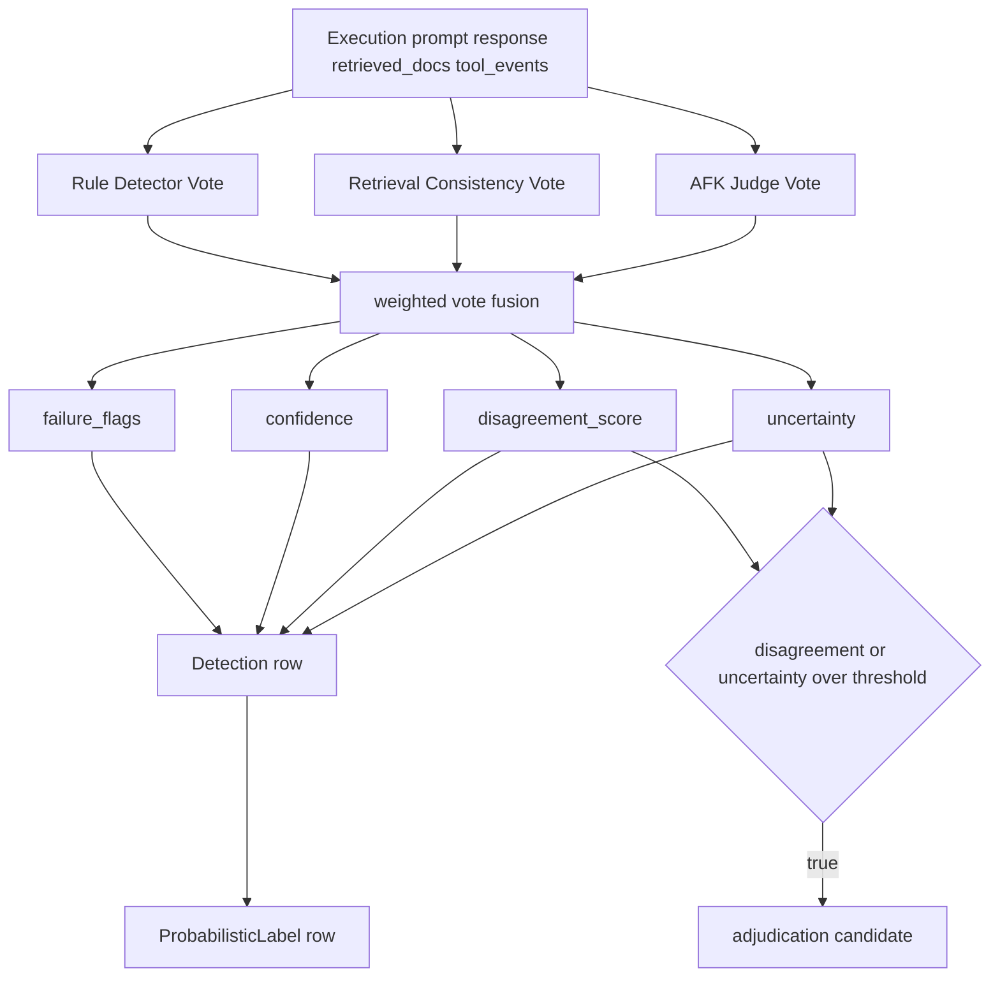

[Back to top](#top)

## Feature to Risk to Advanced Analytics Pipeline

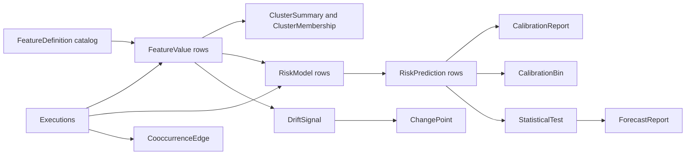

[Back to top](#top)

## Costing and Budget Gate Architecture

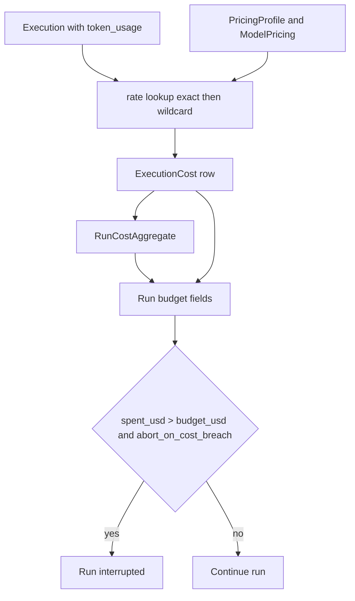

[Back to top](#top)

## Security and Credential Lifecycle

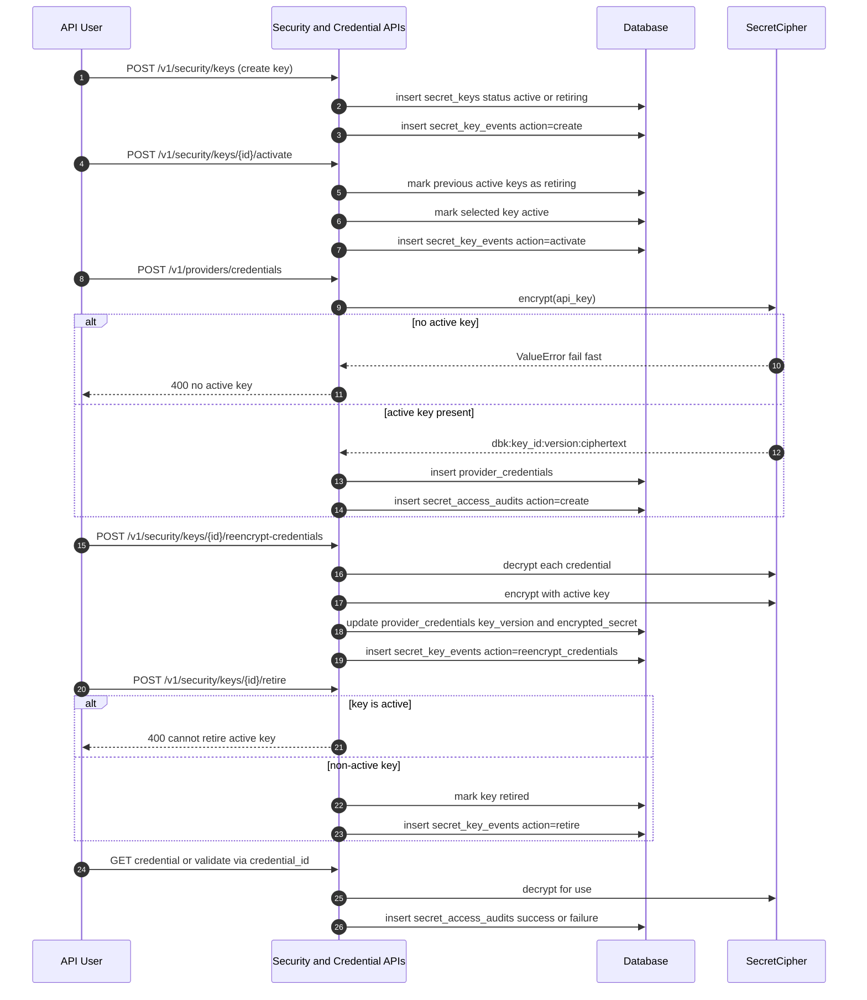

[Back to top](#top)

## Provider Validation Architecture

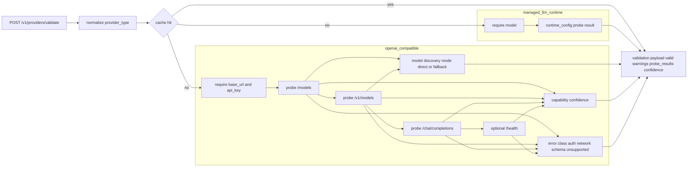

[Back to top](#top)

## Compare Mitigation Reporting Architecture

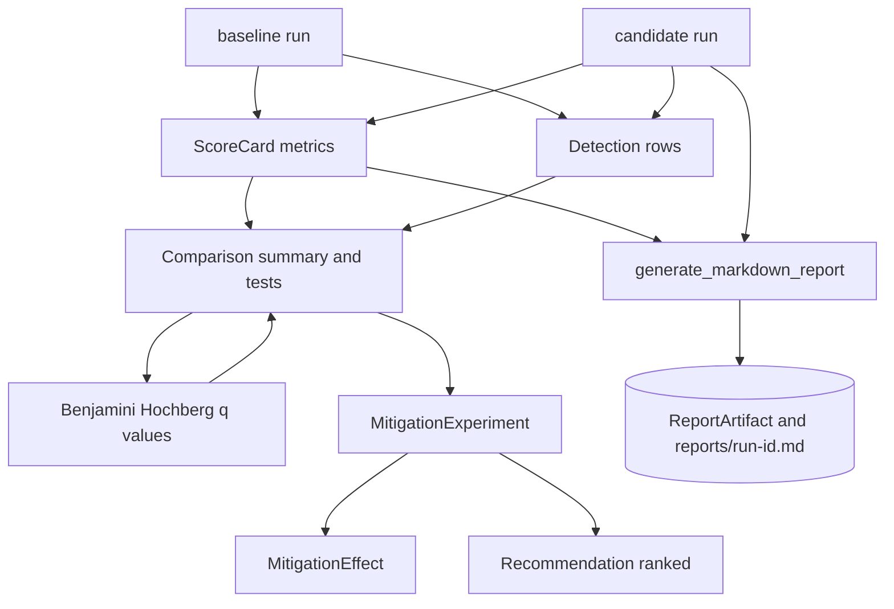

[Back to top](#top)

## Core Data Model ER Diagram

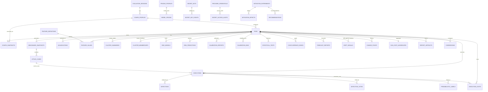

[Back to top](#top)

## Endpoint Grouping by Domain

- Runtime lifecycle and streaming:
  - `POST /v1/runs`
  - `GET /v1/runs/{run_id}`
  - `POST /v1/runs/{run_id}/resume`
  - `GET /v1/runs/{run_id}/events`
  - `GET /v1/runs/{run_id}/ws`
  - `GET /v1/queue/stats`
- Core analytics and DS outputs:
  - `GET /v1/runs/{run_id}/scorecard`
  - `GET /v1/runs/{run_id}/risk-cards`
  - `GET /v1/runs/{run_id}/features`
  - `GET /v1/runs/{run_id}/detector-votes`
  - `GET /v1/runs/{run_id}/clusters`
  - `GET /v1/runs/{run_id}/attack-summary`
  - `GET /v1/runs/{run_id}/node-telemetry`
  - `GET /v1/runs/{run_id}/execution-slices`
  - `GET /v1/runs/{run_id}/drift`
  - `GET /v1/runs/{run_id}/calibration`
  - `GET /v1/runs/{run_id}/inference`
  - `GET /v1/runs/{run_id}/cooccurrence-graph`
  - `GET /v1/runs/{run_id}/forecast`
- Costing and policy telemetry:
  - `GET /v1/runs/{run_id}/cost-summary`
  - `GET /v1/runs/{run_id}/cost-timeseries`
  - `GET /v1/runs/{run_id}/policy-events`
  - `GET /v1/runs/{run_id}/telemetry`
- Providers and credentials:
  - `GET /v1/providers/capabilities`
  - `POST /v1/providers/validate`
  - `POST /v1/providers/credentials`
  - `GET /v1/providers/credentials`
  - `GET /v1/providers/credentials/{credential_id}`
  - `POST /v1/providers/credentials/{credential_id}/rotate`
  - `GET /v1/providers/credentials/{credential_id}/audits`
- Security key lifecycle:
  - `POST /v1/security/keys`
  - `GET /v1/security/keys`
  - `POST /v1/security/keys/{key_id}/activate`
  - `POST /v1/security/keys/{key_id}/reencrypt-credentials`
  - `POST /v1/security/keys/{key_id}/retire`
  - `GET /v1/security/keys/events`
- Orchestration and configuration:
  - `POST /v1/orchestration-profiles`
  - `GET /v1/orchestration-profiles`
  - `GET /v1/orchestration-profiles/{profile_id}`
  - `PATCH /v1/orchestration-profiles/{profile_id}`
  - `POST /v1/sessions`
  - `GET /v1/sessions/{session_id}`
  - `POST /v1/config-profiles`
  - `GET /v1/config-profiles/{profile_id}`
  - `POST /v1/pricing-profiles`
  - `GET /v1/pricing-profiles/{profile_id}`
- Compare mitigation reporting:
  - `GET /v1/compare`
  - `POST /v1/mitigation-experiments`
  - `GET /v1/mitigation-experiments/{experiment_id}`
  - `POST /v1/reports/{run_id}/generate`

[Back to top](#top)

## Scenario Traces for Validation

1. Standard run completes end-to-end.
- Create session, profile, run with `execute_now=true`.
- Run transitions: `queued -> running -> completed`.
- Orchestrator emits benchmark, progress, analytics, scorecard, drift, completed events.
- Scorecard, risk, features, detector votes, cost summary, and report endpoints return populated payloads.

2. Cost gate breach then resume without duplicate execution.
- Run executes with low budget and `abort_on_cost_breach=true`.
- Status transitions to `interrupted` with checkpoint persisted in `AFKRunState`.
- Resume requeues run, skips already processed `attack_case_id` values, and reaches `completed`.
- Execution count equals `total_attacks` after resume.

3. Credential validation with active key and auditable access.
- Key create and activate performed before credential encryption/decryption.
- Provider credential stored as DB-wrapped ciphertext format `dbk:key_id:version:payload`.
- Validation with `credential_id` decrypts key via `SecretCipher` and writes `SecretAccessAudit` records.
- Key lifecycle operations emit `SecretKeyEvent` entries.

4. High disagreement or uncertainty adjudication candidate.
- Multiple detector votes are fused into final detection.
- `disagreement_score` and `uncertainty` computed per execution.
- If threshold exceeded, execution marked as adjudication candidate for review.
- Manual adjudication endpoint can override failure flags and increase confidence.

[Back to top](#top)

## Code Grounding Map

- Runtime and orchestration: `apps/server/app/services/orchestrator.py`
- API and streaming: `apps/server/app/api/v1.py`
- Queue and worker: `apps/server/app/services/run_queue.py`, `apps/server/app/worker.py`
- Adapters and policy: `apps/server/app/services/adapters.py`, `apps/server/app/services/policy.py`
- Benchmark and agentic generation: `apps/server/app/services/benchmark.py`, `apps/server/app/services/agentic_attacking.py`
- Detection, risk, scoring, analytics, drift:
  - `apps/server/app/services/detection.py`
  - `apps/server/app/services/risk.py`
  - `apps/server/app/services/scoring.py`
  - `apps/server/app/services/advanced_analytics.py`
  - `apps/server/app/services/drift.py`
- Costing, security, provider, reporting, compare, mitigation:
  - `apps/server/app/services/costing.py`
  - `apps/server/app/services/security.py`
  - `apps/server/app/services/providers.py`
  - `apps/server/app/services/reporting.py`
  - `apps/server/app/services/compare.py`
  - `apps/server/app/services/mitigation.py`
- Entities and contracts: `apps/server/app/models.py`, `apps/server/app/schemas.py`

[Back to top](#top)
